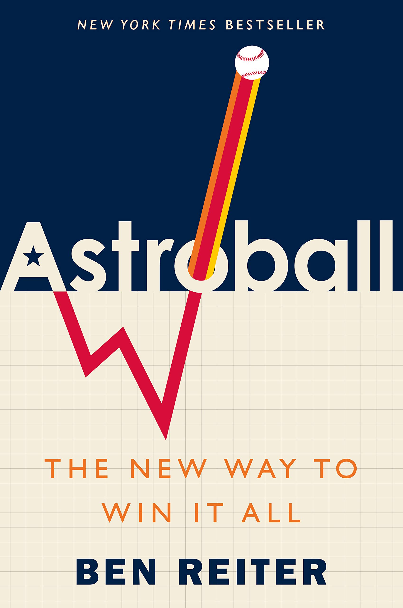

## Tribes by Seth Godin

Overall good content, but could probably be structured/organized in a more meaningful way. The book is divided into short sections that make me think the whole book would do well split into daily emails.

Plenty of good chunks.

Page 101:

> "'Life's too short' is repeated often enough to be a cliche, but this time it's true. You don't have enough time to be both unhappy and mediocre. It's not just pointless, it's painful. Instead of wondering when your next vacation is, maybe you ought to set up a life you don't need to escape from."

Godin acknowledges the organization of the book:

Page 146:
> "I can tell you that I'm going to get a lot of flak from most people about what you've just read. People might say that it's too disorganized or not practical enough or that I require you to do too much work to actually accomplish anything. That's okay. In fact, criticism like that almost always accompanies change."

It's not that the organization of the book makes it less practical per se, but it seems like there are many good fragments that could be combined into a greater whole.

<Bennies :rating="3" />

## Deep Work by Cal Newport

Quote on Page 33:
> "Let your mind become a lens, thanks to the converging rays of attention; let your soul be all intent on whatever it is that is established in your mind as a dominant, wholly absorbing idea."

This advice comes from Antonin-Dalmace Sertillanges, a Dominican friar and professor of moral philosophy, who during the early part of the twentieth century penned a slim but influential volume title *The Intellectual Life*.

Page 82:
> "A workday driven by the shallow, from a neurological perspective, is likely to be a draining and upsetting day, even if most of the shallow things that capture your attention seem harmless or fun."

Page 137:
> "In a 2014 column title 'The Art of Focus,' David Brooks endorsed this approach of letting ambitious goals drive focused behavior, explaining: 'If you want to win the war for attention, don't try to say "no" to the trivial distractions you find on the information smorgasbord; try to say "yes" to the subject that arouses a terrifying longing, and let the terrifying longing crowd out everything else.'"

Page 143:
> "Here's Kreider's explanation: 'Idleness is not just a vacation, an indulgence or a vice; it is as indispensable to the brain as vitamin D is to the body, and deprived of it we suffer a mental affliction as disfiguring as rickets... it is, paradoxically, necessary to getting any work done.'"

Page 146:
> "The implication of this line of research is that providing your conscious brain time to rest enables your unconcious mind to take a shift sorting through your most complex professional challenges. A shutdown habit, therefore, is not necessarily reducing the amount of time you're engaged in productive work, but is instead diversifying the type of work you deploy."

Deep work isn't just a good idea or plan, it's what I innately desire every day

<Bennies :rating="5" />

## Digital Minimalism by Cal Newport

Page 109:
> "Simply put, humans are not wired to be constantly wired."

Page 253:
> "The more you experiment with the ideas and practices on the preceding pages, the more you'll come to realize that digital minimalism is much more than a set of rules, it's about cultivating a life worth living in our current age of alluring devices."

The book reminds you multiple times that "your time = their money" and that they have a lot of money put into stealing your time.

[Related Thrice Song Alert](https://www.youtube.com/watch?v=bdMbqtG8Hvc)

[Here is a somewhat related article I found interesting.](http://nymag.com/intelligencer/2016/09/andrew-sullivan-my-distraction-sickness-and-yours.html)

<Bennies :rating="5" />

## Astroball by Ben Reiter

Page 160:
> "Further, what beyond the data could give a player the confidence to believe that every time he stepped to the plate, it was the pitcher who was in trouble, not him? And what could someone like Beltrán detect in a pitcher's habits that could equip a teammate to understand not just what the probabilities suggested the pitcher would likely throw, but to know for certain?"

I'll give it a 2 out of 5 because the author did a fine job, but... the book means nothing anymore.

<Bennies :rating="2" />

