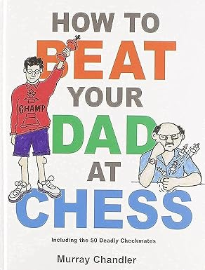
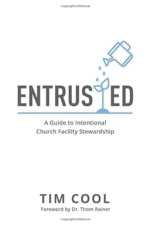

Here lies review of text scrolled by my eyeballs in 2023.

---

## The 40-Day Sugar Fast by Wendy Speake
### Where Physical Detox Meets Spiritual Transformation

The wife wanted to do this together, so we read the one short "chapter" each day. We also ended up watching some documentaries about how messed up our food and food companies are - kind of infuriating. Overall, it was aight.

<Bennies :rating="3" />

## How to Beat Your Dad at Chess by Murray Chandler

I don't know that my dad knows how to play chess, but I could definitely cook him now. My friends and I got into chess for a bit during the covid-times. I still ride the waves of interest I have in it. Come [challenge me on chess.com](https://www.chess.com/member/belowthebenthic).

<Bennies :rating="4" />

## Entrusted by Tim Cool

The general idea is great and I still very often think about being a faithful steward of what I've been entrusted with. I found later chapters to not always be particularly aimed at myself, but it was good info for me at the time.

<Bennies :rating="4" />

## The Coddling of the American Mind by Greg Lukianoff and Jonathan Haidt
### How Good Intentions and Bad Ideas Are Setting Up a Generation for Failure

A bunch of little snowflakes we've become, eh? That's a much more aggressive line than how the book reads. I enjoyed the more pragmatic thoughts and level-headed "arguments" made. It's a further reminder that the sensationalized news is a very poor representation of the actual polarization of society. We ain't all that different and we need to be able to have sensible conversation without being "traumatized". Someone should write [some songs](https://open.spotify.com/track/6tIlpznHyaqCPiVfolKxrV?si=d7bba7956de54ae2) about this stuff.

<Bennies :rating="4" />

## Show Your Work! by Austin Kleon
### 10 Ways to Share Your Creativity and Get Discovered

I continuously ride the pendulum between posting more on social media and staying away from social media more. I find it difficult to extract solely the good parts that come from it while not wasting my time with it. I still generally lean on just staying away from posting things, but maybe this book pushed me to work at finding a better balance there.

<Bennies :rating="4" />